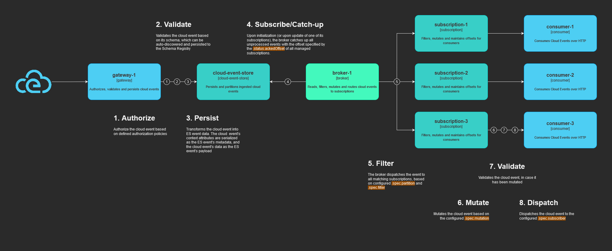

<p align="center">
  
</p>
<hr>

## Contents

- [About](#about)
	+ [Features](#features)
	+ [Benefits](#benefits)
- [Documentation](#documentation)
	+ [Fundamentals](#fundamentals)
	+ [Getting started](#getting-started)
	+ [API Reference](#api-reference)
- [Contributing](#contributing)
	+ [How to contribute](#how-to-contribute)
	+ [Types of contributions](#types-of-contributions)
	+ [Code of conduct](#code-of-conduct)
	+ [Get in touch](#get-in-touch)
	+ [Let's build together](#lets-build-together)
## About

Cloud Streams is a cloud-native tool that empowers users to capture and process [cloud events](https://cloudevents.io/) in real-time, enabling event-driven architectures that are both scalable and efficient. With Cloud Streams, you can customize how you stream, filter, partition, and mutate the [cloud events](https://cloudevents.io/) you consume using declarative rules, giving you full control over how your data is processed and consumed.

As event-driven architectures have become more popular, so too have the challenges associated with building and managing them, especially when dealing with large volumes of data. This is where Cloud Streams comes in. This powerful and straightforward tool provides a simple and effective way to capture, process, and route cloud events in real-time, allowing you to create event-driven architectures that are both flexible and reliable.

### Features

- **Streaming**: Cloud Streams allows users to stream cloud events in real-time, ensuring that all relevant data is captured and processed as soon as it becomes available. This feature is especially useful for applications that require real-time data processing, such as financial trading or IoT applications.
- **Filtering**: Cloud Streams provides powerful filtering capabilities, allowing users to filter cloud events based on declarative rules. This ensures that only relevant data is captured and processed, reducing processing time and improving overall system performance.
- **Persistence**: Cloud Streams ensures that all consumed cloud events are persisted, guaranteeing that data is not lost and will eventually be delivered to the appropriate consumers. This feature is especially useful for mission-critical applications where data loss is not acceptable.
- **Routing**: Cloud Streams provides flexible routing capabilities, allowing users to route cloud events based on declarative rules. This ensures that data is sent to the correct consumers, reducing data processing errors and improving system efficiency.
- **Mutations**: Cloud Streams offers the capability to modify incoming events prior to sending them to subscribers, which allows for backward compatibility and the ability to remove or transform sensitive data.
- **Fault Tolerance**: Cloud Streams provides fault tolerance by implementing atomic, configurable retry policies that enable brokers to resend missed events to a consumer that was previously unavailable or that responded with a non-success status code. This ensures that all missed events are eventually received by the consumer in the order they were originally posted. The retry policy enables potential errors to be fixed at the consumer level, without the risk of losing data.
- **Playback**: Cloud Streams provides playback capabilities, allowing users to play back previously captured cloud events. This can be useful for debugging, testing, or catastrophic recovery purposes. With this feature, users can recover from system failures or data corruption by replaying previously captured events.

### Benefits

- **Scalability**: Cloud Streams is designed to be highly scalable, allowing users to process large volumes of data with ease. This makes it an ideal solution for applications with rapidly changing data requirements.
- **Flexibility**: Cloud Streams provides flexible filtering and routing capabilities, allowing users to customize the way their data is processed and consumed. This ensures that users can adapt to changing data requirements quickly and easily.
- **Efficiency**: Cloud Streams' filtering and routing capabilities improve data processing efficiency, reducing the time and resources required to process data. This can lead to significant cost savings over time.
- **Reliability**: Cloud Streams is designed to be highly reliable, ensuring that data is captured, processed, and consumed accurately and efficiently. This makes it an ideal solution for mission-critical applications.
- **Historical Data Access**: Cloud Streams provides historical data access capabilities, allowing users to access previously captured cloud events. This can be useful for analyzing historical data, as well as for replaying events for debugging, testing, or catastrophic recovery purposes. With this feature, users can recover from system failures or data corruption by accessing previously captured events.
- **Easy to Integrate**: Cloud Streams is extremely easy to integrate in existing solutions. As a matter of fact, producers can publish events to Cloud Streams simply by POSTing Cloud Events, using the [structured content mode](https://github.com/cloudevents/spec/blob/v1.0.2/cloudevents/bindings/http-protocol-binding.md#32-structured-content-mode), to a specific gateway. Consumers, on the other hand, only need to have an endpoint that can accept cloud events sent over HTTP using the [structured content mode](https://github.com/cloudevents/spec/blob/v1.0.2/cloudevents/bindings/http-protocol-binding.md#32-structured-content-mode). That's it. All the configuration, and control, is offloaded to Cloud Streams resources such as subscriptions.

### Want to know more?

Then take a look at our [wiki](https://github.com/neuroglia-io/cloud-streams/wiki)📚, or start a new discussion/issue!

<hr>

*Solution overview:*



## Documentation

### Fundamentals

CloudStreams is a platform that implements [resource-oriented architecture (ROA)](https://github.com/neuroglia-io/cloud-streams/wiki/Fundamentals#resources) to allow users to customize the behavior and configuration of event processing. Similar to Kubernetes Custom Resources, CloudStreams resources enable users to define specific configurations without modifying the underlying system. These resources serve as templates for various aspects of event handling within the CloudStreams ecosystem, offering flexibility to tailor event processing to specific architectural needs.

[Cloud Events](https://github.com/neuroglia-io/cloud-streams/wiki/Fundamentals#cloud-events) are a standardized format used by CloudStreams to represent events in cloud environments. They encapsulate essential information about an event, such as its type, source, and data, fostering interoperability and seamless integration across different cloud services.

[Streams](https://github.com/neuroglia-io/cloud-streams/wiki/Fundamentals#streams) in CloudStreams are ordered, append-only collections of events, providing comprehensive auditing and enabling efficient event handling. Events are automatically [partitioned](https://github.com/neuroglia-io/cloud-streams/wiki/Fundamentals#partitions) based on attributes like source, type, and subject, allowing for scalable and responsive architectures.

CloudStreams [subscriptions](https://github.com/neuroglia-io/cloud-streams/wiki/Fundamentals#subscriptions) empower users to configure event dispatching based on partitions, filters, and mutations. This fine-grained control optimizes event-driven applications by ensuring that relevant events are efficiently processed and delivered to consumers based on specific criteria.

*Please view the [wiki](https://github.com/neuroglia-io/cloud-streams/wiki/Fundamentals)📚 for additional information.*

### Getting started

The easiest way to start the solution is using ``docker-compose``. 

To to this, clone the repository:

```shell
git clone https://github.com/neuroglia-io/cloud-streams.git
```

Navigate to the resulting `/cloud-streams/` directory, then run the following command:

```shell
docker-compose -f "deployments/docker-compose/docker-compose.yml" up
```

Now that everything is up and running, you can start publishing cloud events using POST requests on the gateway's ingestion endpoint, at `http://localhost:8080/api/events/pub`:

```shell
curl -X 'POST' \
  'http://localhost:8080/api/events/pub' \
  -H 'accept: */*' \
  -H 'Content-Type: application/cloudevents+json' \
  -d '{
  "id": "1234567890",
  "specversion": "1.0",
  "source": "https://foo.bar.com",
  "type": "bar.foo",
  "subject": "foobar",
  "dataschema": "string",
  "data": {
    "foo": "bar"
  }
}'
```

You can start consuming cloud events by creating a new subscription, which can be done via [Dashboard](http://localhost:8080/subscriptions), or by executing a simple POST request:

```shell
curl -X 'POST' \
  'http://localhost:8080/api/resources/v1/subscriptions?dryRun=false' \
  -H 'accept: text/plain' \
  -H 'Content-Type: text/json' \
  -d '{
  "metadata": {
    "name": "my-subscription"
  },
  "spec": {
    "subscriber": {
      "uri": "https://webhook.site/00000000-0000-0000-0000-000000000000"
    },
	"stream":{
	  "offset": 0
	}
  }
}'
``` 

The preceeding sample creates a new subscription to all events (no partition has been defined and no filter has been set). Because we have defined the stream offset at '0', when will start receiving all events ever published, even the ones published before the creation of the subscription. 

Note that, by default, subscriptions will only process cloud events published **after** their creation.

*For more information on subscriptions, please check the [wiki](https://github.com/neuroglia-io/cloud-streams/wiki/Fundamentals#subscriptions)📚.*

<hr>

The `Dashboard UI` is served by the `gateway` and is reachable at [http://localhost:8080](http://localhost:8080/).

The `Swagger UI`, also served by the `gateway`, is reachable at [http://localhost:8080/api/doc](http://localhost:8080/api/doc).

### API Reference

*Please refer to the [wiki](https://github.com/neuroglia-io/cloud-streams/wiki/API-Reference)📚.*

## Contributing

👋 **Welcome Contributors!**

We're thrilled that you're interested in contributing to our project on GitHub. Whether you're a seasoned developer or new to open source, there are many ways you can contribute and make a difference.

### How to Contribute

1. **Fork the Repository**: Start by forking our repository to your GitHub account.
2. **Clone the Repository**: Clone the forked repository to your local machine using `git clone`.
3. **Create a Branch**: Create a new branch for your contribution (`git checkout -b my-feature`).
4. **Make Changes**: Make your changes and additions to the codebase.
5. **Commit Changes**: Commit your changes with descriptive commit messages.
6. **Push Changes**: Push your changes to your forked repository (`git push origin my-feature`).
7. **Submit a Pull Request**: Open a pull request from your forked repository to our main repository.

### Types of Contributions

- **Bug Fixes**: Help us squash those pesky bugs.
- **Feature Additions**: Introduce new features or enhancements.
- **Documentation**: Improve our documentation to make it more comprehensive.
- **Code Optimization**: Help optimize existing code for better performance.
- **Issue Reporting**: Report bugs, suggest features, or ask questions by opening issues.

### Code of Conduct

Please review and adhere to our [Code of Conduct](code-of-conduct.md) while participating in this project.

### Get in Touch

If you have any questions or need assistance, feel free to reach out via GitHub issues or discussions.

### Let's Build Together!

Every contribution counts, no matter how big or small. We appreciate your time and effort in making our project better. Thank you for being part of our open source community!

Happy Coding! 🚀
